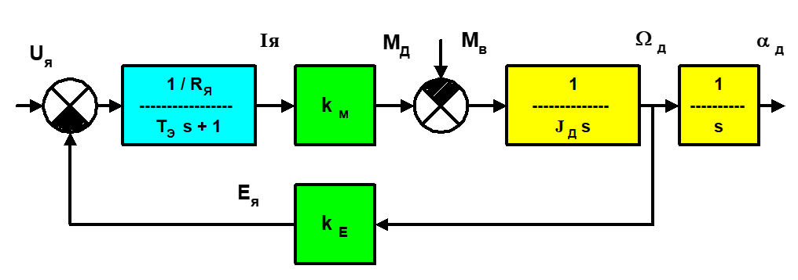
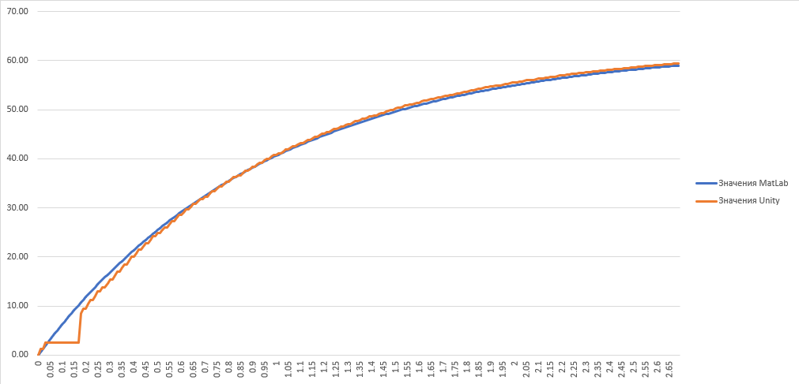

# Поянительная записка к проектной работе
## на тему:  Программный комплекс двигателя постоянного тока RB-35GM 07 TYPE

Выполнили магистранты группы АДМ-17-07:  
-Горелов А.Р.  
-Соболева А.А.  
-Хромов Д.А.  

Содержание:
1. Описание модели двигателя
    - Технические характеристики двигателя
    - Математическая модель двигателя
    - Описание объектов сцены в среде Unity

2. Описание процесса тестирования

3. Описание интерфейса

4. Список используемых источников

### Описание модели двигателя
##### Технические характеристики двигателя RB-35GM 07 TYPE
- Номинальное напряжение: 12В
- Номинальный ток: 1630 мА
- Ток холостого хода: 350 мА
- Номинальная скорость двигателя (под нагрузкой): 5090 об/мин
- Скорость холостого хода двигателя: 6000 об/мин
- Передаточное отношение редуктора: 10
- Номинальный момент: 1 кг*с
##### Математическая модель двигателя
Математическая модель ДПТ



К сожалению, данная модель показала себя слишком трудоемкой для пересчета в вид, 
пригодный для использования в Unity,и очень ресурсоемкой для использования в 
реальном времени. 

Поэтому для моделирования была использована упрощенная модель, состоящая из двух 
частей. Расчет скорости в установившемся режиме по формуле:
```math
V=(\frac{U}{k_{e}} - \frac{R_{a}}{k_{m}*k_{e}} * M_{a})/Ratio
```
где:<br/>
U - номинальное напряжение;<br/>
Ra - сопротивление якоря;<br/>
km - коэффициент момента двигателя;<br/>
ke - коэффициент ЭДС двигателя;<br/>
Ma - внешний приложенный момент.<br/>
Ratio - передаточный коэффициент редуктора.<br/>
Данная формула была взятата из курса лекций, указанного в источниках. С помощью данной формулы, зная номинальное напряжение(U) и скорость холостого хода, пересчитанную из оборотов в минуту в радианы в секунду(V), можно получить значение ke(и km, поскольку численно они равны):
```math
k_{e}=\frac{U}{V} = \frac{12}{628.3} = 0.019099156 = k_{m}
```
Используя эту же формулу и учитывая, что при приложении к валу двигателя внешнего момента, равного номинальному(пересчитанному в Н*м), скорость будет равняться нулю, можно получить значение Ra(Ом):
```math
R_{a}=\frac{U*k_{m}}{M_{a}}=\frac{12*0.019099156}{0.09807}=2.3370028
```
Вторая часть модели - приблизительное моделирование переходных процессов(разгона и торможения), выполненное аналогично действию П-регулятора.<br/>
Она работает следующим образом: текущее значение скорости модели сравнивается с расчетным и, в случае несовпадения, каждую миллисекунду к текущему значению прибавляется(или отнимается) разница между скоростями, деленная на коэффициент. 
Опытным путем было получено, что для получения переходного процесса, наиболее близкого по длительности к полноценной модели двигателя, коэффициент составляет 1000. В коде программы это выглядит следующим образом:
```c#
if (speed != speed_calc)
        {
            if (speed <= speed_calc)
                speed += (speed_calc - speed) / 1000 * Time.deltaTime * 1000;
            if (speed >= speed_calc)
                speed -= (speed - speed_calc) / 1000 * Time.deltaTime * 1000;
        }
```
При использовании данной модели форма переходного процесса аналогична реальной (увеличение скорости с равномерным уменьшением ускорения до нуля в установившемся режиме), с двумя упрощениями:
1. Поскольку к скорости прибавляется разница между реальной и расчетной скоростью, деленная на коэффициент, реальное значение скорости будет асимптотически стремиться к расчетному. Однако, как показали результаты, при округлении даже до четырех знаков после запятой скорость можно приравнять к расчетной.
2. При приложении внешнего момента в начале процесса разгона отсутствует провал ниже нулевой скорости, так как внешний момент в данной модели применяется лишь при расчете конечного значения скорости.<br/>
По результатам моделирования данной модели и модели двигателя в системе Matlab было получено среднеквадратичное отклонение переходного процесса разгона от 0 до скорости холостого хода, представленной в этой программе, от аналогичного процесса в Matlab. Зачение отклонения(в радианах в секунду):
```math
\sigma=1.00780809613569
```
Графики полученных переходных процессов:

##### Описание объектов сцены в среде Unity
Сцена в Unity состоит из следующих объектов:
1. Prefab, составляющий модель двигателя, состоящий из трех элементов: неподвижный цилиндр, изображающий корпус двигателя, цилиндр меньших размеров, являющийся валом, и параллелепипед, присоединенный к валу для демонстрации вращения вала. Все операции вращения приложены к валу, параллелепипед является дочерним объектом вала и потому вращается вместе с ним.
2. Параллелепипед с малой высотой, изображающий пол или поверхность, на которой расположен двигатель.
3. Основная камера, со стороны которой показана сцена.
4. Источник света.<br/>
Также в сцену был добавлен интерфейс, позволяющий управлять подаваемым на двигатель напряжением и внешним моментом, приложенным к валу двигателя, состоящий из:
1. Слайдера, управляющего напряжением двигателя в вольтах (от 0 до 12)
2. Слайдера, управляющего внешним моментом в Н*мм (от 0 до 98.07) таким образом, чтобы максимальный момент, приложенный к валу, замедлял вращение вала двигателя до нуля при максимальном приложенном напряжении
3. Трех текстовых блоков, показывающих текущие значения скорости, напряжения и внешнего момента.
### Описание процесса тестирования
Тестирование двигателя производится в режиме PlayMode(с использованием моделирования). Тест работает следующим образом: запускается сцена, задаются необходимые переменные, соответствующие модели двигателя, моделирование производится в течении заданного времени, после чего скорость сравнивается с трубкой ошибки, составляющей от 0.95 до 1.05 расчетной скорости. В результате моделирования было выбрано время, равное 3 секундам. В программном коде тестирование выглядит так:
```c#
[UnityTest]
	[Timeout(180000)]
	public IEnumerator TestMotor()
	{
        var root = InitScene();
        var motor_prefab = AssetDatabase.LoadAssetAtPath<GameObject>("Assets/Prefabs/Motor.prefab");
        var motor = GameObject.Instantiate(
            motor_prefab,
            new Vector3(0, 0, 5),
            new Quaternion(0, 0, 0, 0));
        var model = motor.gameObject.GetComponentInChildren<MotorModel>();
        model.U_vh = 12.0F;
        model.ke = 0.01909915F;
        model.km = 0.01909915F;
        model.Ra = 2.3370028F;
        model.Me = 0F;
        model.Ratio = 10F;
        yield return null;
        var low = ((model.U_vh / model.ke) - model.Ra / (model.km * model.ke) * (model.Me/1000)) / model.Ratio * 0.95;
        var high = ((model.U_vh / model.ke) - model.Ra / (model.km * model.ke) * (model.Me/1000)) / model.Ratio * 1.05;
        Assert.IsFalse(model.speed == 0);
        yield return new WaitForSecondsRealtime(3);
        Assert.IsFalse(model.speed < low);
        Assert.IsTrue((model.speed >= low) && (model.speed <= high));
    }
```
Приведенный тест, будучи пройденным, показывает, что спустя три секунды установившаяся скорость двигателя соответствует расчетной в пределах пятипроцентного отклонения.
### Список используемых источников

1. Андреев В.П. Лекции по курсу: "Сенсорные и управляющие системы роботов"
2. Краткое руководство по Маркдауну URL: https://paulradzkov.com/2014/markdown_cheatsheet/  
3. Руководство Unity URL: https://docs.unity3d.com/ru/530/Manual/UnityManual.html  
4. Pro GIT URL: https://git-scm.com/book/ru/v1
5. Илюхин Ю.В. Лекции по курсу "Электрические и гидравлические приводы"